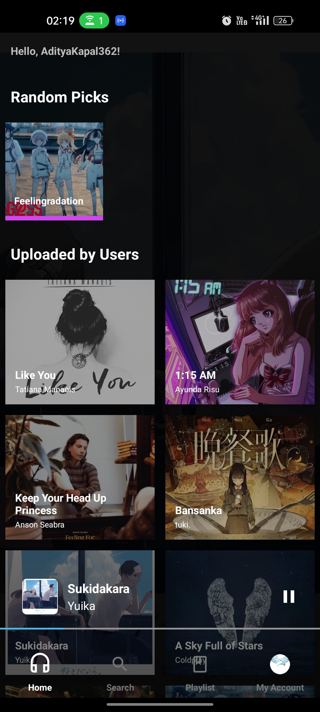
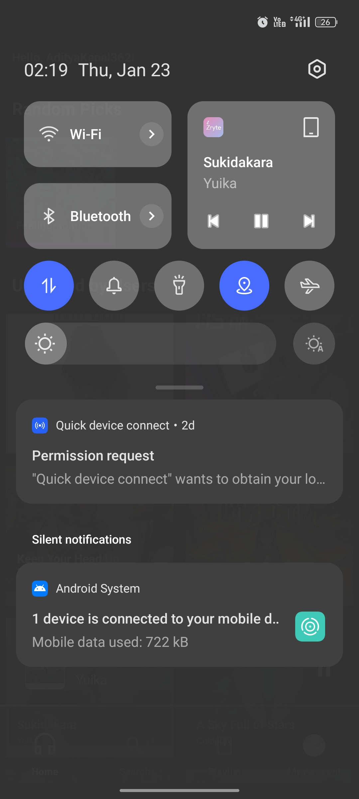
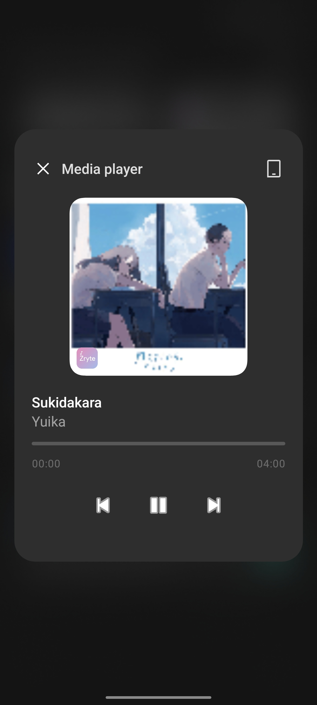

# ZryteZene Mobile - Java
> [!NOTE]
> **ZryteZene** is a multi-platform app to allow users to stream musics across various devices seamlessly, such as Android, desktop and web platform. Its completely free and ad-free too.
**ZryteZene Mobile** is an ad-free, background-enabled music streaming app designed to provide a seamless and uninterrupted music experience for Android users. Unlike traditional streaming services, Zryte prioritizes user freedom and simplicity while delivering essential features for music enthusiasts. Whether you're at home, on the go, or working out, Zryte ensures your favorite tracks are always just a tap away.

# Development

> Currently under development by limited persons, so it may take longer to finish, its hard to implement the run-in-background system where since Android 14 or newer restricted the background services the most. Estimated time to finish: 6 weeks - 7 months, hehe.

# Requirements
- Minimum SDK   : Android 8 / API 27 (Oreo)
- Compile SDK   : Android 14 / API 34 (Upside Down Cake)
- Language      : Java - Native

## Features
- **Ad-Free Experience**: Enjoy your music without interruptions from ads.
- **Background Playback**: Continue listening even when the app is minimized or your screen is off.
- **MediaStyle Notifications**: Control your music directly from the notification panel with an intuitive interface.
- **Seamless Playback**: Play, pause, skip, and resume music effortlessly.
- **Offline Support (Coming Soon)**: Download tracks for offline listening.
- **Simple and Intuitive UI**: Navigate easily with a clean and user-friendly interface.

## Future Plans
- **Offline Playback**: Allow users to download songs and play them without an internet connection.
- **Listen Pairing**: Create a play room and listen to the songs together with them.
- **Equalizer Integration**: Customize your listening experience.
- **Dynamic Themes**: Support for light and dark themes.